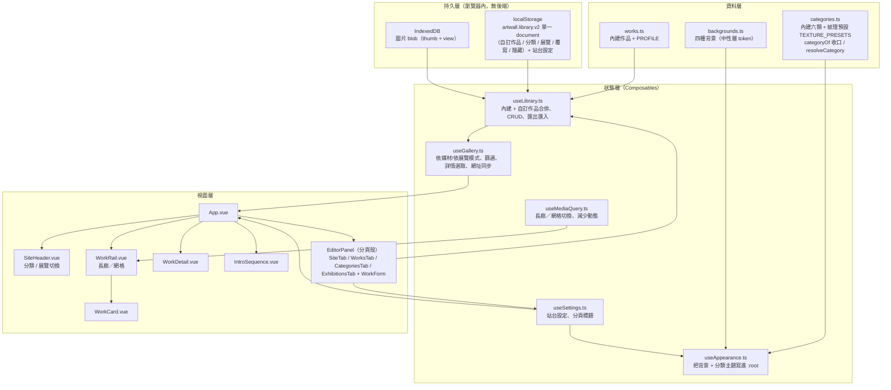

# 系統架構文件

## 系統架構圖

## 模組職責

| 模組 | 職責 | 不負責 |
|------|------|--------|
| `data/works.ts` | 內建作品資料與作者預設值 | 使用者的編輯結果 |
| `data/categories.ts` | 內建六類 + 紋理預設 `TEXTURE_PRESETS`；`categoryOf`（分類讀取唯一收口，孤兒回中性 fallback）、`resolveCategory`（自訂分類算完整 theme） | 中性色（那是背景的事） |
| `data/backgrounds.ts` | 四種背景的中性層 token | 強調色 |
| `composables/useLibrary.ts` | 作品／分類／展覽的合併與 CRUD、單一 document 持久化與 v1→v2 遷移、匯出匯入 | 篩選與選取 |
| `composables/useGallery.ts` | 依媒材/依展覽模式、篩選與詳情選取、網址同步 | 資料從哪來 |
| `composables/useAppearance.ts` | 兩層主題寫進 `:root` | 決定用哪個主題 |
| `composables/useSettings.ts` | 站台設定與分頁標題 | 作品資料 |
| `utils/color.ts` | 由 accent 以 HSL 推導暗底 `accentDark`、對比度計算 | 顏色語意以外 |
| `utils/image.ts` | 壓縮成縮圖／詳情用圖、比例偵測 | 儲存 |
| `utils/idb.ts` | IndexedDB 存取 | 資料語意 |
| `utils/placeholder.ts` | 幾何佔位圖 | 真實圖片 |

## 資料流

### 讀取

1. `useLibrary.init()` 讀 localStorage 的 `artwall.library.v2` document；無 v2 但有舊 `works/overrides/hidden.v1` 三 key 時自動遷移組出並寫回（**不刪舊 key**，可回滾；v2 已存在則不重跑）
2. 依 `imageKey` 從 IndexedDB 取出 blob，`createObjectURL` 接回 `thumb` / `src`
3. `allWorks` = 自訂作品（在前）+ 內建作品（套用覆寫、排除隱藏）；`categories` = 內建六類 + 自訂分類
4. `useGallery` 依模式篩選——依媒材＝`activeCategory`，依展覽＝該展覽 `workIds` 的有序清單 → `WorkRail` 渲染

### 寫入（上傳）

1. `WorkForm` 選檔 → `detectAspect()` 立即把版位帶進表單
2. 送出 → `processImage()` 壓成 thumb（800px）與 view（1800px）
3. 兩份 blob 寫進 IndexedDB（`<id>-thumb` / `<id>-view`）
4. metadata（不含 blob URL）寫進 localStorage
5. 內建作品的編輯不改原始資料，只疊一層 `overrides`，可還原

## 兩層主題系統

正交設計：**任何背景 × 任何分類都要能看**。

| 層 | 來源 | 控制的 CSS 變數 |
|----|------|----------------|
| 中性層 | `backgrounds.ts` | `--bg` `--surface` `--ink` `--ink-soft` `--ink-faint` `--line` `--line-strong` |
| 分類層 | `categories.ts` | `--accent` `--texture` `--ease` `--card-radius` `--card-border` |

唯一的交叉點是強調色：`data-scheme="dark"` 時取 `accentDark`，否則取 `accent`。
墨色（書法 `#3d3a35`）與石膏灰（立體 `#6b6355`）在暗底會整個消失，因此每個分類都必須備兩版——
內建六類的 `accentDark` 手工調校；使用者自訂分類則由 `utils/color.ts` 從 accent 自動推導並驗暗底對比度。

背景紋理鋪在 `body::before` 獨立圖層，暗色時整層 `filter: invert(1)`——
紋理是黑線，不反相就看不見。

## 版面尺寸的唯一真相

| 模式 | 尺寸來源 | 說明 |
|------|---------|------|
| 長廊（≥900px） | 軌道高度 | 卡片高 → 圖框高 → 由 `aspect-ratio` 反推圖框寬 → 卡片寬。說明文字絕對定位，不參與寬度計算 |
| 網格（<900px） | 欄寬 | 圖框寬 100% → 由 `aspect-ratio` 推得高度 |

兩種模式都不讓圖片的固有尺寸參與版面計算，這是「圖片不會撐破版面」的根本原因。

## 技術棧

- Vue 3（`<script setup>`）+ TypeScript + Vite
- 樣式：CSS Variables，無 UI 框架、無動畫函式庫
- 儲存：localStorage（`artwall.library.v2` 單一 document + 站台設定）+ IndexedDB（圖片 blob），無後端
- 檢查：ESLint 9 + typescript-eslint + eslint-plugin-vue
