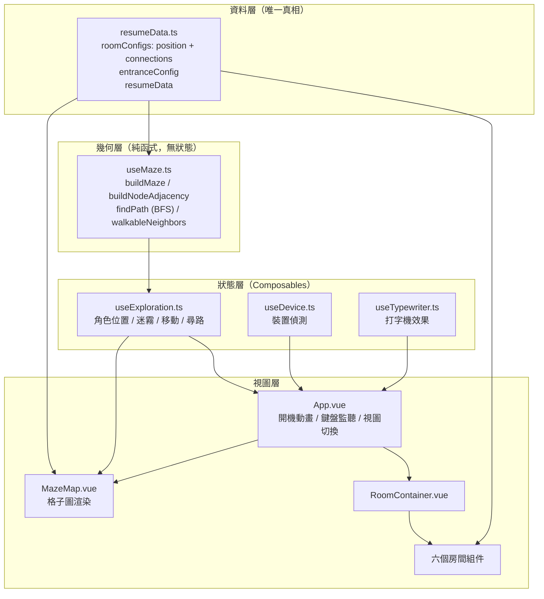
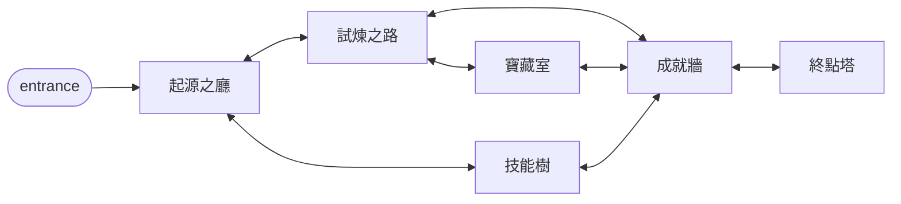
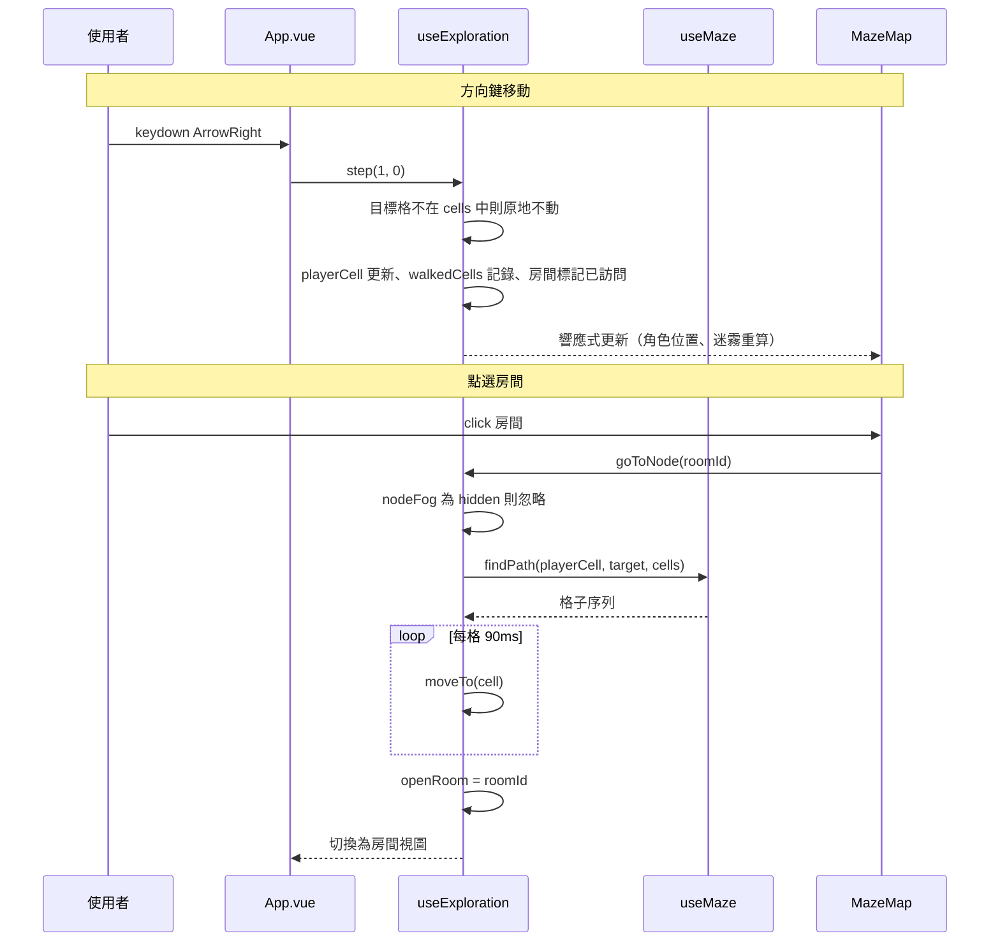

# 系統架構文件

## 系統架構圖



## 專案結構

```
src/
├── components/
│   ├── maze/MazeMap.vue         # 格子圖渲染（房間、走廊、角色、迷霧、HUD）
│   ├── rooms/                   # 六個房間內容組件
│   └── ui/RoomContainer.vue     # 房間容器（主題色、返回）
├── composables/
│   ├── useMaze.ts               # 迷宮幾何：格子展開、走廊繞徑、BFS
│   ├── useExploration.ts        # 探索狀態：角色位置、迷霧、移動
│   ├── useDevice.ts             # 裝置偵測
│   └── useTypewriter.ts         # 打字機效果
├── data/resumeData.ts           # 履歷內容 + 房間配置 + 入口配置
├── styles/
│   ├── main.css                 # 基礎樣式與 @import 入口
│   ├── crt.css                  # CRT 效果 + 琥珀調色盤
│   └── nes-amber.css            # nes.css 琥珀化覆寫層
├── types/index.ts               # 型別定義
└── App.vue                      # 根組件
```

## 核心設計：connections 是迷宮拓撲的唯一真相

`resumeData.ts` 的 `position`（邏輯格子座標）與 `connections`（房間連通關係）決定
整座迷宮。`useMaze` 負責把這份拓撲展開成可行走的格子圖，**沒有第二套座標**。

### 座標 ×2 展開

邏輯上相鄰的兩個房間（如 `origin(1,0)` 與 `quest(2,0)`）若不展開會直接貼在一起，
中間沒有格子放走廊。×2 之後變成 `(2,0)` 與 `(4,0)`，空出 `(3,0)` 當走廊。

| 節點 | 邏輯座標 | 格子座標 |
|------|---------|---------|
| entrance | (0,0) | (0,0) |
| origin | (1,0) | (2,0) |
| quest | (2,0) | (4,0) |
| treasure | (3,0) | (6,0) |
| skill | (0,1) | (0,2) |
| achievement | (2,1) | (4,2) |
| contact | (2,2) | (4,4) |

實際格子圖為 7 × 5，含 7 個房間格與 12 個走廊格。

### 走廊繞徑

每條 `connection` 以 L 形繞徑生成走廊：先試垂直優先，若會穿過其他房間就改水平優先。
兩種都撞牆時發出 `console.warn` 而非默默畫出穿牆走廊 —— 那代表資料層的 `position`
擺放與 `connections` 兜不攏，屬於設定錯誤，應該被看見。

### 迷宮拓撲



入口**只連接起源之廳**。改寫前 MazeMap 把入口硬連到全部 6 房，繞過 connections，
迷宮因此退化成一張畫成地圖的選單。

## 迷霧規則

| 層級 | 房間條件 | 走廊條件 | 呈現 |
|------|---------|---------|------|
| `visible` | 已訪問 | 已走過 | 全亮 + 圖示 + 名稱 |
| `dim` | 與已訪問房間拓撲相鄰 | 緊鄰已走過格子或已訪問房間 | 28% 透明度，只有輪廓與「?」 |
| `hidden` | 其餘 | 其餘 | 完全不渲染 |

「總覽」模式（`showOverview`）直接讓所有節點回傳 `visible`，一鍵揭開全圖 ——
遊戲層必須是加分而非路障。

## 資料流



## 操作方式

| 裝置 | 移動 | 進入房間 |
|------|------|---------|
| 桌機 | 方向鍵 / WASD 逐格 | 站上房間後按 Enter，或點選房間自動尋路 |
| 手機 | 點選房間自動尋路 | 尋路抵達後自動開啟 |

不採虛擬搖桿：履歷流量大半在手機，搖桿體驗差。手機與桌機的點選走同一套
`goToNode`，差別只在輸入方式。

## 技術棧

| 類別 | 技術 | 用途 |
|------|------|------|
| 框架 | Vue 3（`<script setup>`） | 響應式 UI |
| 語言 | TypeScript | 型別安全 |
| 建置 | Vite | 開發與建置 |
| UI | nes.css（`nes-core.min.css`） | 像素 UI 元件結構，配色由 `nes-amber.css` 覆寫 |
| 檢查 | ESLint 9 + typescript-eslint + eslint-plugin-vue | Lint |

> 動畫全部以 CSS 實作，無動畫函式庫。

## 樣式系統

### 琥珀單色調色盤

全站單一色相，六房間僅以「色溫」區分 —— 模擬單色 CRT 只有一種磷光的物理限制。

```css
:root {
  --color-amber: #ffb000;        /* 基準 */
  --color-amber-bright: #ffd166;
  --color-amber-deep: #ff7a14;

  --color-origin: #ffe6b0;       /* 最淡金 */
  --color-treasure: #ffd23d;
  --color-achievement: #ffbe55;
  --color-contact: #ffb000;
  --color-skill: #ff9c2e;
  --color-quest: #ff7a14;        /* 最熱深橘 */

  --color-bg: #0f0a02;           /* 暖黑 */
  --color-text: #ffc46b;
}
```

主題色一律經 `.theme-{roomId}` 設定 `--room-color` 套用。**資料層不存顏色** ——
`RoomConfig` 刻意不含 `color` 欄位，避免與 CSS 變數形成第二份真相。

### nes.css 覆寫

`nes-amber.css` 保留 nes.css 的像素 UI 結構（4px 硬邊框、凹角、按鈕立體陰影），
把配色全換成琥珀。`.nes-btn` / `.nes-progress` 的凹角是內嵌 SVG 的 `border-image`，
顏色寫死 `rgb(33,37,41)` 無法用變數覆寫，只能整個 data URI 換掉。
